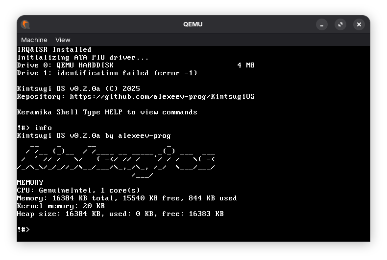

# KintsugiOS

<div align="center">
  <!--  -->

  <h3>Минималистичная операционная 32 разрядная система с монолитным ядром и собственным загрузчиком на (N)ASM и GCC 15</h3>

  <div align="center">
    <!-- <a href="https://marketplace.visualstudio.com/items?itemName=alexeevdev.KintsugiOSuage-syntax">
      	
    </a> todo: идея сделать расширение для вскода со сниппетами для ядра -->
    <a href="https://alexeev-prog.github.io/KintsugiOS/">
		  
    </a>
  </div>
</div>

<br>

<div align="center">
  
  
  
  
  <a href="https://github.com/alexeev-prog/KintsugiOS/stargazers">
        
  </a>
  
  
</div>

<div align="center">
  
</div>


Минималистичная x86 операционная система на (N)ASM и C, созданная в образовательных целях для глубокого понимания принципов работы операционных систем.

Текущая нестабильная версия: v0.1.1a
Последняя стабильная версия: [v0.1.0a](https://github.com/alexeev-prog/KintsugiOS/releases/tag/v0.1.0a)

> [!CAUTION]
> KintsugiOS еще в активной стадии разработки и многие решения не финальные или нестабильные.

 > Также я занимаюсь [переводом OSDEV-Notes](https://github.com/alexeev-prog/Osdev-Notes-RU)



## Особенности

### Реализовано
- **Загрузчик** с переходом из реального режима в защищённый
- **GDT** (Глобальная таблица дескрипторов)
- **Управление памятью** с аллокаторами:
  - Аллокатор на основе связанных блоков памяти
  - Paging интегрирован в аллокацию памяти
- **Драйверы**:
  - VGA-экран с поддержкой цветного текста
  - Клавиатура (PS/2)
  - Таймер
- **Система прерываний** (IDT, ISR, IRQ)
- **Командная оболочка** "Keramika Shell" с поддержкой команд:
  - `help` - список команд
  - `clear` - очистка экрана
  - `end` - остановка CPU
  - `malloc` - выделение памяти
  - `free` - освобождение памяти
  - `info` - информация о системе
  - `memdump` - дамп памяти
  - И другие...
- **Библиотека KKLibC (Kintsugi Kernel LibC)** включая:
  - Работу со строками, генерация числа и прочие стандартные вещи (stdlib.h)
  - Форматированный вывод (stdio.h)
  - Функции памяти (mem.h)
  - Библиотека для математики (math.h)
  - Типы данных (ctypes.h)
  - Общий заголовочный файл kklibc.h
  - Страничная обработка памяти (paging.h)
  - Библиотека дополнительных типов данных (datatypes)
    - Вектора (vector.h)
  - Библиотека стандартных методов (stdlib.h)

### В разработке
- [ ] Файловая система
- [ ] Многозадачность (под вопросом)
- [ ] Пользовательский режим
- [ ] Сетевой стек
- [ ] Псевдографический интерфейс
- [ ] Полностью реализованный LibC

### Готово
- [x] Виртуальная память (Paging)
- [x] Аллокаторы памяти
- [x] Чувствительность к регистру

## Требования

Для сборки и запуска KintsugiOS необходим следующий инструментарий:

- [Кросс-компилятор i386 ELF GCC](http://newos.org/toolchains/i386-elf-15.1.0-Linux-x86_64.tar.xz)
- FASM
- NASM
- GDB для отладки
- MTools и Xorriso
- QEMU или Bochs

Проверить готовность окружения можно скриптом:
```bash
./check-env.sh
```

## Сборка и запуск

### Базовая сборка
```bash
make
```

### Создание образа диска и запуск в QEMU
```bash
make run
```

### Запуск в QEMU с отладкой
```bash
make debug
```

### Очистка проекта
```bash
make clean      # Удаление бинарных файлов
make clean_all  # Полная очистка
```

## Отладка

Для отладки KintsugiOS запустите систему в режиме отладки:
```bash
make debug
```

И подключитесь через ваш дебаггер (например gdb).

## Как работает загрузка

1. **BIOS** загружает первый сектор диска (512 байт) по адресу 0x7C00
2. **Загрузчик** инициализирует стек, загружает GDT и переключается в защищённый режим
3. **Ядро** загружается по адресу 0x1000 и получает управление
4. **Ядро** инициализирует драйверы, менеджер памяти и командную оболочку

## Команды оболочки

KintsugiOS включает оболочку "Keramika Shell" со следующими командами:

- `end` - остановка процессора
- `clear` - очистка экрана
- `malloc <size>` - выделение памяти (куча)
- `free <address>` - освобождение памяти
- `info` - информация о системе
- `memdump` - дамп памяти
- `echp <text>` - вывод текста
- `help` - справка по командам
- `sleep <ms>` - ожидать N секунд
- `reboot` - перезагрузка
- `rand <seed>` - генерация случайного числа по алгоритму xorshift32
- `randrange <seed> <min> <max>` - генерация случайного числа в диапазоне при помощи xorshift32
- `binpow <base> <exponent>` - бинарное возведение в степень
- `fib <num>` - алгоритм фибоначчи

## Литература и источники

### Ассемблер
- Зубков С. В. «Assembler для DOS, Windows и Unix»
- [Введение в машинный код](http://wasm.ru/article.php?article=1022001)
- [Программирование на ассемблере под DOS](http://wasm.ru/article.php?article=1022003)

### Язык C
- Керниган Б., Ритчи Д. «Язык программирования C»
- Шилдт Г. «Полный справочник по C»

### Операционные системы
- Таненбаум Э. «Современные операционные системы»
- Таненбаум Э. «Операционные системы: Разработка и реализация»
- [OSDEV Wiki](http://osdev.org)

### Архитектура ЭВМ
- Таненбаум Э. «Архитектура компьютера»
- Гук М. «Аппаратные средства IBM PC. Энциклопедия»

## Лицензия

KintsugiOS распространяется под лицензией MIT. Подробнее см. в файле LICENSE.

## Вклад в проект

Приветствуются issues и pull requests. Перед внесением изменений пожалуйста:
1. Обсудите планируемые изменения в issue
2. Следуйте существующему кодстайлу
3. Добавляйте комментарии на русском языке
4. Тестируйте изменения в QEMU и Bochs

## Благодарности

Особая благодарность сообществу OSDev и авторам учебных материалов, указанных в разделе "Литература и источники".

---

<div align="center">
<sub>Название "Kintsugi" отсылает к японскому искусству восстановления керамики золотым лаком — метафора красоты в несовершенстве и постоянного развития.</sub>
</div>
