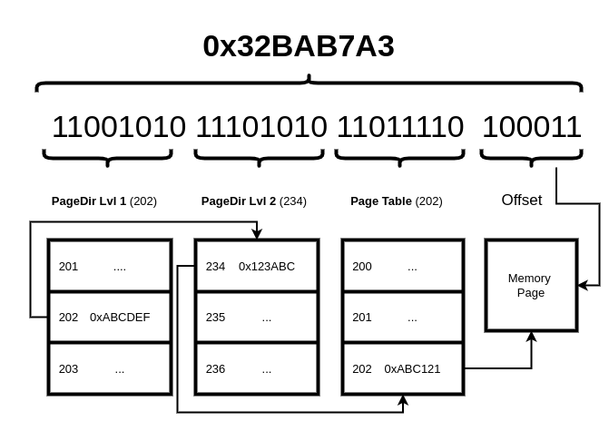

# Страничная организация памяти (Paging)

## Что такое страничная организация памяти?

Страничная организация памяти (paging) — это схема управления памятью, которая вводит концепции **_логических адресов_** (виртуальных адресов) и **_виртуальной памяти_**. На архитектурах x86_* это реализуется на аппаратном уровне. Paging обеспечивает уровень трансляции между виртуальными и физическими адресами, а также между виртуальным и физическим адресными пространствами, а также добавляет несколько дополнительных функций (таких как защита доступа, защита уровня привилегий).

Она вводит несколько новых концепций, которые объясняются ниже.

### Страница (Page)

Страница — это непрерывный блок памяти, точный размер которого зависит от поддержки архитектуры. На x86_64 мы имеем размеры страниц: 4 КБ, 2 МБ и, опционально, 1 ГБ. Наименьший размер страницы также называется page frame (страничный кадр), поскольку он представляет собой наименьшую единицу, с которой может работать блок управления памятью (MMU), и, следовательно, наименьшую единицу, с которой можем работать мы! Каждая запись в таблице страниц описывает одну страницу.

### Каталоги и таблицы страниц (Page Directories and Tables)

Это основные строительные блоки страничной организации. В зависимости от архитектуры (и запрошенного размера страницы) их может быть разное количество.

- Например, если мы работаем в 32-битном режиме со страницами по 4 КБ, у нас есть каталог страниц (page directory) и таблица страниц (page table).
- Если мы работаем в 64-битном режиме со страницами по 4 КБ, у нас есть четыре уровня таблиц страниц: 3 каталога и 1 таблица.

Что это за каталоги и таблицы? Давайте начнем с таблиц:

*   **Таблица страниц (Page Table)** содержит информацию об одной странице памяти. Запись в таблице страниц представляет начальный физический адрес памяти для этой страницы.
*   **Каталог страниц (Page Directory)** — запись в каталоге страниц, в зависимости от выбранного размера страницы, может указывать на:
    - другой каталог страниц
    - таблицу страниц
    - или на память (непосредственно)

Специальный регистр `CR3` содержит адрес корневого каталога страниц. Этот регистр имеет следующий формат:

*   биты с 12 по 63 (31, если мы работаем в 32-битном ядре) содержат адрес корневого каталога страниц.
*   биты с 0 по 11 меняют свое значение в зависимости от значения 14-го бита в CR4, но в этой главе и для наших целей они не relevant (имеют значения), поэтому их можно оставить равными 0.

Иногда CR3 (хотя технически это только данные, начиная с бита 12+) называют PDBR (Page Directory Base address Register) — регистр базового адреса каталога страниц.

### Виртуальный (или логический) адрес

Виртуальный адрес — это то, что видит работающая программа. Любая программа: драйвер, пользовательское приложение или само ядро.

Иногда в ядре виртуальный адрес будет соответствовать тому же физическому адресу; этот сценарий называется `identity mapping` (тождественное отображение), однако это не всегда так, мы также можем иметь один и тот же физический адрес, отображаемый на разные виртуальные адреса.

Виртуальный адрес обычно представляет собой комбинацию номеров записей для каждого уровня таблиц. На рисунке ниже показан на примере, как работает трансляция адресов:



*Страница памяти* на картинке относится к странице физической памяти (вышеприведенный рисунок не относится к какой-либо существующей аппаратной реализации paging, это просто пример сценария). Используя логические адреса и страничную организацию, мы можем ввести совершенно новое адресное пространство, которое может быть намного больше доступной физической памяти.

Например, у нас может быть:

```c
phys(0x123'456) = virt(0xFFF'F234'5235)
```

Это означает, что виртуальный адрес `0xFFFF2345235` ссылается на физический адрес `0x123456`.

Это отображение обычно достигается с помощью нескольких иерархических таблиц, где каждый элемент на одном уровне указывает на таблицу следующего уровня. Как уже упоминалось выше, виртуальный адрес является комбинацией *номеров записей* для каждого уровня таблиц. Теперь предположим, например, что у нас есть 3-уровневая страничная организация, 32-битная адресация, и механизм трансляции адресов используется, как на рисунке выше, и у нас есть следующий виртуальный адрес:

```c
virtaddress = 0x2F880120
```

Глядя на рисунок выше, мы знаем, что биты:

*   *0 - 5* представляют собой смещение (offset — какое местоположение мы хотим получить внутри страницы физической памяти).
*   *6 - 13* — это запись в таблице страниц.
*   *14 - 21* — это запись в каталоге страниц уровня 1.
*   *21 - 31* — это запись в каталоге страниц уровня 2.

Мы можем преобразовать указанный выше адрес в:

*   Смещение: 0x20 байт внутрь страницы.
*   Запись в таблице страниц: номер 0x4 (она указывает на страницу памяти).
*   Запись в каталоге (Dir 1): 0x20 (она указывает на таблицу страниц).
*   Запись в каталоге (Dir 2): 0xBE (она указывает на каталог Dir 1).

Приведенный выше пример — это просто воображаемый механизм трансляции; фактический `x86_64` 4-уровневый paging мы обсудим ниже. Если нам интересно, как можно получить доступ к первому каталогу страниц, это станет ясно позже, но ответ заключается в том, что обычно существует специальный регистр, содержащий базовый адрес корневого каталога страниц (в этом примере — каталог уровня 1).

## Страничная организация в длинном режиме (Long Mode)

В 64-битном режиме у нас есть до 4 уровней таблиц страниц. Их количество зависит от размера, который мы хотим назначить каждой странице.
Стоит отметить, что новые процессоры поддерживают функцию *la57* (адресация с использованием 57 бит), которая просто добавляет еще один уровень таблиц страниц поверх существующих 4, чтобы позволить использовать большее адресное пространство. Это крутая функция, но на самом деле не требуется, если мы не используем огромные объемы памяти.

Есть 3 возможных сценария:

*   Страницы по 4 Киб: Мы будем использовать все 4 уровня, поэтому адрес будет состоять из записей всех 4 таблиц.
*   Страницы по 2 МиБ: в этом случае нам нужно только 3 уровня страниц.
*   Страницы по 1 ГиБ: Требуется только 2 уровня.

Для реализации paging настоятельно рекомендуется уже иметь реализованные прерывания, в частности обработку #PF (вектор 0xE).

4 уровня каталогов/таблиц страниц:

*   Таблица уровня 4 отображения страниц (PML4 — Page-Map Level-4 Table),
*   Таблица указателей каталога страниц (PDPR — Page-Directory Pointer Table),
*   Таблица каталога страниц (PD — Page-Directory Table),
*   и Таблица страниц (PT — Page Table).

Количество уровней зависит от выбранного размера страниц.
Если мы используем страницы размером `4 Киб`, то у нас будет: PML4, PDPR, PD, PT, в то время как если мы выберем страницы размером `2 МиБ`, у нас будет только PML4, PDPR, PD, и, наконец, для страниц размером `1 ГиБ` будут использоваться только PML4 и PDPR.

## Структура каталогов и таблиц страниц

Как мы видели ранее в этой главе, когда страничная организация включена, виртуальный адрес преобразуется в набор номеров записей в различных таблицах. В этом параграфе мы увидим различные типы записей, доступные для них в архитектуре `x86_64`.

Но прежде чем перейти к деталям, давайте рассмотрим некоторые общие характеристики для всех типов таблиц/каталогов:

*   Размер всех типов таблиц фиксирован и составляет 4 КБ.
*   Каждая таблица имеет ровно 512 записей.
*   Каждая запись имеет размер 64 бита.
*   Таблицы имеют иерархию, и каждый элемент в таблице более высокого уровня иерархии указывает на таблицу более низкого уровня (с некоторыми исключениями, объясненными позже). Таблица страниц указывает на область памяти.

Иерархия таблиц следующая:

*   PML4 — это корневая таблица (та, которая содержится в регистре PDBR) и загружается для фактической трансляции адресов (см. следующий параграф). Каждая из ее записей указывает на таблицу PDPR.
*   PDPR — следующий уровень вниз. Каждая запись указывает на один каталог страниц.
*   Каталог страниц (PD): в зависимости от значения бита PS (размер страницы) запись в этой таблице может указывать на:
    *   таблицу страниц, если бит PS сброшен (это означает, что мы используем страницы по 4 КБ)
    *   область памяти размером 2 МБ, если бит PS установлен
*   Таблица страниц (PT): каждая запись в таблице страниц указывает на страницу памяти размером 4 КБ.

Важно отметить, что архитектура x86_64 поддерживает смешивание размеров страниц.

В следующих параграфах мы более подробно рассмотрим, как включается страничная организация, общие части всех записей в этих таблицах, и посмотрим, что они означают.

### Загрузка корневой таблицы и включение страничной организации

До сих пор мы объясняли, как работает трансляция адресов; теперь давайте посмотрим, как загружается Корневая Таблица (в `x86_64` это PML4). Это делается путем загрузки специального регистра `CR3`, также известного как `PDBR`, который мы представили в начале главы; его содержимое — это basically базовый адрес нашей таблицы PML4. Это можно легко сделать двумя строками ассемблера:

```x86asm
   mov eax, PML4_BASE_ADDRESS
   mov cr3, eax
```

Первый `mov` необходим, потому что `cr3` можно загрузить только из другого регистра. Имейте в виду, что для перехода в long mode у нас уже должна быть включена страничная организация, поэтому первые таблицы страниц должны быть загружены очень рано в процессе загрузки. После включения мы можем изменить содержимое `cr3`, чтобы загрузить новое адресное пространство.

Это также можно сделать с помощью встроенного ассемблера (inline assembly):

```c
void load_cr3( void* cr3_value ) {
    asm volatile("mov %0, %%cr3" :: "r"((uint64_t)cr3_value) : "memory");
}
```

Синтаксис встроенного ассемблера будет объяснен в одной из глав приложений: [Информация о языке C](../99_Appendices/C_Language_Info.md). `mov` в регистр здесь скрыт меткой `"r"` перед переменной `cr3_value`; эта метка указывает, что значение переменной должно быть помещено в регистр.

Биты, которые нам нужно установить, чтобы включить страничную организацию в long mode, по порядку: `PAE` (Page Address Extension — расширение адресации страниц), бит номер 5 в CR4, `LME` (Long Mode Enable Bit — бит включения длинного режима, бит 8 в MSR EFER, должен быть загружен с помощью инструкций `rdmsr`/`wrmsr`), и, наконец, `PG` (Paging bit — бит страничной организации, бит номер 31 в `cr0`).

Каждый раз, когда нам нужно изменить значение системного регистра, `cr*` и подобных, мы всегда должны сначала загрузить текущее значение и обновить его содержимое, иначе мы можем столкнуться с проблемами. И, наконец, бит страничной организации (PG) должен быть включен последним.

Установка этих битов должна быть выполнена только один раз на ранних этапах процесса загрузки (вероятно, это одно из первых действий, которые мы делаем).

### Структуры записей PML4, PDPR и PD

Структуры записей PML4 и PDPR идентичны, в то время как у PD есть несколько отличий. Давайте начнем со структуры первых двух типов:

| 63   | 62 ... 59              | 58 ... 52 | 51 ... 40            | 39 ... 12              | 11  ...  9 |
|------|------------------------|-----------|----------------------|------------------------|------------|
|**XD**| **PK** или available    | Available | _Reserved must be 0_ | **Базовый адрес таблицы** | Available  |


|8   ...   6 | 5     |  4      |  3      |  2      |  1      | 0     |
|------------|-------|---------|---------|---------|---------|-------|
| _Reserved_ | **A** | **PCD** | **PWT** | **U/S** | **R/W** | **P** |

Где **Базовый адрес таблицы** — это базовый адрес таблицы PDPR, если таблица является PML4, или базовый адрес PD, если таблица является PDPR.

Теперь Каталог Страниц (PD) имеет несколько отличий:

*   Биты с 39 по 12 — это базовый адрес таблицы страниц при использовании страниц размером 4 КБ или область физической памяти размером 2 МБ, если установлен бит PS.
*   Биты 6 и 8 должны быть равны 0.
*   Бит 7 — это бит Размера Страницы (PS); если установлен, это означает, что запись указывает на страницу размером 2 МБ, если сброшен — она указывает на Таблицу Страниц (PT).
*   Если мы используем страницы размером 2 МБ, биты с 12 по 20 зарезервированы и должны быть равны 0. Если это не так, доступ к адресу в этом диапазоне вызовет #PF.

### Таблица страниц (Page Table)

Структура записи таблицы страниц все еще похожа на приведенную выше, но она содержит еще несколько битов, которые можно установить:

| 63   | 62 ... 59              | 58 ... 52 | 51 ... 40            | 39 ... 12             | 11  ... 9 |
|------|------------------------|-----------|----------------------|-----------------------|-----------|
|**XD**| **PK** или available    | Available | _Reserved must be 0_ | **Базовый адрес страницы** | Available |


| 8     | 7       | 6      | 5     |  4      |  3      |  2      |  1      | 0     |
|-------|---------|--------|-------|---------|---------|---------|---------|-------|
| **G** | **PAT** | **D**  | **A** | **PCD** | **PWT** | **U/S** | **R/W** | **P** |


В этой таблице есть 3 новых бита (D, PAT, G), и базовый адрес страницы, как уже объяснялось, указывает не на таблицу, а на физическую память, которую представляет эта страница.

В следующем разделе мы пройдемся по полям записи.

### Поля записей таблиц/каталогов страниц

Ниже приведен список всех полей, присутствующих в записях таблиц, с объяснением наиболее часто используемых.

*   **P** (Present — Присутствует): Если установлен, это сообщает ЦП, что эта запись действительна и может быть использована для трансляции. В противном случае трансляция останавливается здесь и приводит к page fault.
*   **R/W** (Read/Write — Чтение/Запись): Страницы всегда доступны для чтения; установка этого флага разрешает запись в память через этот виртуальный адрес. В противном случае попытка записи в память при сброшенном этом бите приводит к page fault. Напоминание: эти биты также влияют на дочерние таблицы. Поэтому, если запись PML4 помечена как read-only, любой адрес, который транслируется через нее, будет только для чтения, даже если записи в таблицах ниже нее имеют этот бит установленным.
*   **U/S** (User/Supervisor — Пользователь/Супервизор): Описывает необходимый уровень привилегий для доступа к этому адресу. Если сброшен, страница имеет уровень супервизора, а если установлен — уровень пользователя. ЦП идентифицирует уровень супервизора/пользователя, проверяя CPL (Current Protection Level — текущий уровень защиты, устанавливаемый сегментными регистрами). Если он меньше 3, то доступы осуществляются в режиме супервизора, если равен 3 — в пользовательском режиме.
*   **PWT** (Page-level Write Through — Сквозная запись на уровне страницы): Управляет политикой кэширования (сквозная запись или обратная запись). Обычно я оставляю его равным 0; для получения дополнительной информации обращайтесь к руководствам разработчика Intel.
*   **PCD** (Page-level Cache Disable — Отключение кэша на уровне страницы): Управляет кэшированием отдельных страниц или таблиц. Обычно я оставляю его равным 0; для получения дополнительной информации обращайтесь к руководствам разработчика Intel.
*   **A** (Accessed — Accessed): Это значение устанавливается ЦП; если оно равно 0, это означает, что к странице еще не обращались. Устанавливается, когда к странице (или таблице страниц) обращались с момента последнего сброса этого бита.
*   **D** (Dirty — Изменена): Если установлена, указывает, что в страницу производилась запись с момента последнего сброса. Этот флаг, предположительно, применяется только к таблицам страниц, но некоторые эмуляторы устанавливают его и на других уровнях. Этот флаг и флаг Accessed предоставлены для использования программным обеспечением управления памятью, ЦП устанавливает его только тогда, когда его значение равно 0. В противном случае менеджеру памяти операционной системы решать, нужно ли его очищать или нет. Их также можно игнорировать.
*   **PS** (Page Size — Размер страницы): Зарезервировано в PML4; если установлено в PDPR, это означает, что трансляция адресов останавливается на этом уровне и отображается страница размером 1 ГБ. Проверьте поддержку страниц размером 1 ГБ перед использованием этого. Чаще это можно установить в записи PD, чтобы остановить трансляцию на этом уровне и отобразить страницу размером 2 МБ.
*   **PAT** (Page Attribute Table Index — Индекс таблицы атрибутов страниц) только для таблицы страниц: Выбирает запись PAT (в сочетании с битами PWT и PCD, указанными выше); обратитесь к руководству Intel для более подробного объяснения.
*   **G** (Global — Глобальная): Если установлена, указывает, что при загрузке CR3 или переключении задач эту конкретную запись не следует вытеснять. Эта функция не является архитектурной, и перед использованием следует проверить ее наличие.
*   **PK** (Protection Key — Ключ защиты): 4-битное значение, используемое для управления доступом уровня супервизора и пользователя для виртуального адреса. Если бит 22 (PKE) установлен в CR4, регистр PKRU будет использоваться для управления правами доступа на уровне пользователя на основе PK, а если установлен бит 24 (PKS), то же самое произойдет, но для accesses уровня супервизора с регистром PKRS. **Примечание**: Это значение игнорируется на старых ЦП, что означает, что эти биты помечены как available (доступные) на них. Если вы хотите использовать ключ защиты, убедитесь, что проверили его наличие с помощью CPUID и, конечно же, установили соответствующие биты для него в регистре CR4.
*   **XD** (Execute Disable — Запрет выполнения): Также известен как NX; бит запрета выполнения доступен только если поддерживается ЦП (можно проверить с помощью CPUID), в противном случае зарезервирован. Если поддерживается и после включения этой функции в EFER (см. руководство Intel по этому поводу), попытка выполнения кода со страницы с установленным этим битом приведет к page fault.

Примечание относительно PWT и PCD: определение этих битов зависит от того, используются ли PAT (таблицы атрибутов страниц) или нет. Для лучшего понимания этих двух бит, пожалуйста, обратитесь к самой обновленной документации Intel (находится в разделе Paging руководства Intel Software Developer Manual vol.3).

## Трансляция адресов

### Трансляция адресов с использованием страниц размером 2 МБ

Если мы используем страницы размером 2 МБ, вот как адрес будет обрабатываться механизмом страничной организации:

|              |           |               |              |            |
|--------------|-----------|---------------|--------------|------------|
| 63 .... 48   | 47 ... 39 | 38   ...   30 |  29  ..  21  | 20 ...  0  |
|  1 ...  1    | 1  ...  1 | 1    ...    0 |  0   ... 0   | 0  ...  0  |
| **Sgn. ext** | **PML4**  |    **PDPR**   | **Page dir** | **Offset** |

*   Биты с 63 по 48 не используются в трансляции адресов.
*   Биты с 47 по 39 — это запись PML4.
*   Биты с 38 по 30 — это запись PDPR.
*   Биты с 29 по 21 — это запись PD.
*   Смещение в каталоге страниц.

Каждая таблица имеет 512 элементов, поэтому у нас есть адресное пространство размером $512*512*512*0x200000$ (это размер страницы)

### Трансляция адресов с использованием страниц размером 4 КБ

Если мы используем страницы размером 4 КБ, вот как адрес будет обрабатываться механизмом страничной организации:

|              |           |           |              |                |             |
|--------------|-----------|-----------|--------------|----------------|-------------|
| 63 ... 48    | 47 ... 39 | 38 ... 30 |  29 ... 21   | 20  ...  12    |  11 ...  0  |
| 1  ...  1    | 1  ...  1 | 1  ... 0  |  0  ... 0    | 0   ...  0     |  0  ... 0   |
| **Sgn. ext** |  **PML4** |  **PDPR** | **Page dir** | **Page Table** | **Offset**  |

*   Биты с 63 по 48 не используются в трансляции адресов.
*   Биты с 47 по 39 — это запись PML4.
*   Биты с 38 по 30 — это запись PDPR.
*   Биты с 29 по 21 — это запись PD.
*   Биты с 20 по 12 — это запись PT.
*   Смещение в таблице страниц.

Так же, как и выше:
Каждая таблица имеет 512 элементов, поэтому у нас есть адресное пространство размером: $512*512*512*512*0x1000$ (это размер страницы)

## Page Fault (Страничное прерывание, отсутствие страницы)

Page Fault (исключение 14, вызывает прерывание с тем же номером) возникает, когда трансляция адресов не удается по любой причине. Код ошибки помещается в стек перед вызовом обработчика прерывания, описывая ситуацию, в которой произошел сбой. Обратите внимание, что эти биты описывают, *что* происходило, а не *почему* произошел сбой. Если установлен пользовательский бит (U/S), это не обязательно означает, что это было нарушение привилегий. Регистр `CR2` также содержит адрес, вызвавший сбой.

Идея обработчика page fault заключается в том, чтобы посмотреть на код ошибки и Faulting Address (адрес, вызвавший сбой), и сделать одно из нескольких действий:
- Если программа обращается к памяти, к которой она должна иметь доступ, но которая не была отображена: отобразить эту память, как изначально запрашивалось.
- Если программа пытается получить доступ к памяти, к которой ей нельзя, завершить программу.

Код ошибки имеет следующую структуру:

|            |         |          |         |         |       |
|------------|---------|----------|---------|---------|-------|
| 31 .... 4  |   4     |    3     |    2    |    1    |   0   |
| _Reserved_ | **I/D** | **RSVD** | **U/S** | **W/R** | **P** |

Значения этих битов расшифрованы ниже:

*   Биты 31...4 зарезервированы.
*   Бит 4: установлен, если сбой произошел при выборке инструкции.
*   Бит 3: установлен, если attempted translation (попытка трансляции) встретила зарезервированный бит, установленный в 1 (на *каком-то* уровне в структуре страничной организации).
*   Бит 2: установлен, если доступ был осуществлен в пользовательском режиме (user mode), в противном случае это был режим супервизора (supervisor mode).
*   Бит 1: установлен, если сбой был вызван записью (write), в противном случае это было чтение (read).
*   Бит 0: установлен, если сбой вызван нарушением защиты (protection violation), в противном случае это означает, что трансляция не удалась из-за отсутствующей страницы (non-present page).

## Доступ к таблицам страниц и физической памяти

### Рекурсивное отображение страниц (Recursive Paging)

Одна из проблем, с которыми мы сталкиваемся при включении _paging_, — это как получить доступ к каталогам и таблицам страниц, если нам нужно получить к ним доступ, и особенно когда нам нужно отобразить новый физический адрес.

Есть два способа достичь этого:

*   Иметь всю физическую память отображенной где-то в виртуальном адресном пространстве (вероятно, в _Higher Half_ — верхней половине; в этом случае мы должны иметь возможность легко извлекать все таблицы, просто добавляя префикс к физическому адресу таблицы).
*   Использовать технику, называемую _recursion_ (рекурсия), где доступ к таблицам осуществляется с помощью специальных виртуальных адресов.

Чтобы использовать рекурсию, единственное, что нам нужно сделать, это зарезервировать запись в _корневом_ каталоге страниц (`PML4` в нашем случае) и сделать так, чтобы ее базовый адрес указывал на сам каталог.

Хорошая идея — выбрать номер, достаточно большой, чтобы он не interfered (вмешивался) в другие специальные адреса ядра/оборудования. Например, давайте используем запись `510` для рекурсивного элемента.

Создание self reference (самоссылки) довольно просто, нам просто нужно использовать физический адрес каталога в качестве базового адреса для создаваемой записи:

```c
pml4[510l] = pml4_physical_address | PRESENT | WRITE;
```

Это следует сделать снова при настройке paging на ранних этапах загрузки.

Теперь, как мы видели выше, трансляция адресов разделит `виртуальный адрес` на номера записей для различных таблиц, начиная с самого левого (корневого). Итак, теперь, если у нас есть, например, следующий адрес:

```c
virt_addr = 0xff7f80005000
```

Записи в этом адресе: 510 для PML4, 510 для PDPR, 0 для PD и 5 для PT (мы используем страницы размером 4 КБ для этого примера). Теперь давайте посмотрим, что происходит с точки зрения трансляции адресов:

*   Сначала загружается `510-я` запись PML4, которая является указателем на PDPR, и в этом случае ее содержимое — это сам PML4.
*   Теперь он получает следующую запись из адреса, чтобы загрузить PD, это снова `510-я`, и это снова сам PML4, поэтому он также загружается как PD.
*   Пришло время для третьей записи, PT, и в этом случае у нас есть `0`, поэтому он загружает первую запись из загруженного Каталога Страниц, которая в этом случае все еще является PML4, поэтому он загружает таблицу PDPR.
*   Наконец, загружается запись PT, то есть `5`, и поскольку текущий PD, загруженный для трансляции, на самом деле является PDPR, мы получим `5-й` элемент каталога страниц.
*   Теперь последняя часть адреса — это смещение, которое затем можно использовать для доступа к записям загруженного каталога/таблицы.

Это означает, что путем careful (тщательного) использования рекурсивного элемента из PML4 мы можем получить доступ ко всем таблицам.

Еще несколько примеров трансляции адресов:

*   PML4: 511 (hex: 1ff) - PDPR: 510 (hex: 1fe) - PD 0 (hex: 0) с использованием страниц размером 2 МБ преобразуется в: `0xFFFF'FFFF'8000'0000`.
*   Предположим, мы отобразили PML4 саму на себя в записи 510,
    - Если мы хотим получить доступ к содержимому самой страницы PML4, используя рекурсию, нам нужно построить специальный адрес, используя записи: _PML4: 510, PDPR: 510, PD: 510, PT: 510_, теперь помните, что 510-я запись PML4 — это сам PML4, поэтому это означает, что когда процессор загружает эту запись, он загружает сам PML4 вместо PDPR, но теперь значение для записи PDPR все еще равно 510, что все еще является PML4, затем загруженная таблица снова является PML4, повторите этот процесс для PD и PT с номером страницы, равным 510, и мы получили доступ к таблице PML4.
    - Используя аналогичный подход, мы можем получить доступ к другим таблицам, например, следующие значения: _PML4: 510, PDPR:510, PD: 1, PT: 256_, дадут доступ к Каталогу Страниц PD под номером записи 256 в PDPR, который содержится в первой записи PML4.

Эта техника упрощает доступ к таблицам страниц в текущем адресном пространстве, но она не работает для доступа к данным в других адресных пространствах. Для этой цели нам нужно будет использовать другую технику или переключиться на это адресное пространство, что может быть довольно затратно.

### Прямое отображение (Direct Map)

Другая техника для модификации таблиц страниц — это 'direct map' (прямое отображение, похожее на identity map). Как мы знаем, identity map — это когда физический адрес страницы совпадает с ее виртуальным адресом, и мы можем описать это как: `paddr = vaddr`. Прямое отображение иногда называют _offset map_ (смещенное отображение), потому что оно вводит смещение, что дает нам некоторую гибкость. Мы будем использовать глобальную переменную, содержащую смещение для нашего отображения, называемую `dmap_base`. Обычно мы устанавливаем ее на некоторый адрес в верхней половине (higher half), чтобы нижняя половина адресного пространства была полностью свободна для пользовательских программ. Это также упрощает другие части ядра позже.

Как же на самом деле работает прямое отображение? Это достаточно просто: мы просто отображаем всю физическую память на тот же виртуальный адрес *плюс смещение dmap_base*: `paddr = vaddr - dmap_base`. Теперь, чтобы получить доступ к физической странице (из нашего PMM, например), мы просто добавляем к ней `dmap_base` и можем читать и записывать в нее как обычно.

Прямое отображение требует единоразовой настройки рано в процессе загрузки вашего ядра, так как вам нужно отобразить всю используемую физическую память, начиная с `dmap_base`. Это не больше работы, чем создание identity map.

Какой адрес следует использовать для базового адреса прямого отображения? Ну, вы можете поместить его по наименьшему адресу в верхней половине, который зависит от того, сколько уровней таблиц страниц у вас есть. Для 4-уровневой страничной организации это будет `0xffff'8000'0000'0000`.

В то время как рекурсивное отображение требует использования только одной записи в таблице страниц на высшем уровне, прямое отображение consumes (потребляет) приличный кусок адресного пространства. Прямое отображение также более гибкое, так как позволяет ядру получать доступ к произвольным частям физической памяти по мере необходимости. Прямое отображение действительно возможно только в 64-битных ядрах из-за большого доступного адресного пространства; 32-битным ядрам следует выбрать рекурсивное отображение, чтобы уменьшить объем используемого адресного пространства.

Реальный потенциал этой техники раскроется, когда у нас будет несколько адресных пространств для обработки, когда ядру может потребоваться обновлять данные в разных адресных пространствах (особенно структуры данных страничной организации); в этом случае, используя прямое отображение, оно может получить доступ к любым данным в любом адресном пространстве, зная только их физический адрес. Это также поможет, когда мы начнем работать с драйверами устройств (выходящими за рамки этой книги), где ядру может потребоваться доступ к буферам DMA, которые хранятся по своим физическим адресам.

### Поиск и устранение неисправностей (Troubleshooting)

Есть несколько вещей, которые следует учитывать при попытке доступа к структурам страничной организации с использованием техники рекурсии для архитектуры `x86_64`:

*   При указании записей с использованием постоянных чисел (не хранящихся в переменных) во время преобразования всегда используйте long-версию, добавляя букву "l" (т.е. 510-я запись становится: 510l). Особенно при работе с макросами, потому что в противном случае они могут быть преобразованы в неправильный тип, вызывая неверный результат. Обычно `gcc` показывает предупреждающее сообщение при компиляции, если это происходит:

```gcc
 warning: result of ‘510 << 30’ requires 40 bits to represent, but ‘int’ only has 32 bits
 ```

*   Всегда помните о необходимости proper sign extension (правильного знакового расширения) любых адресов, если мы создаем их из ничего. Нам не нужно будет знаковое расширение при каждой операции, так как things are usually relative to a pointer we've already set up (все обычно относительно указателя, который мы уже установили). ЦП вызовет page fault, если это хороший адрес, но что-то не так в таблицах страниц, и general protection fault (общую ошибку защиты), если виртуальный адрес является non-canonical (неканоническим, это плохой адрес).
```
